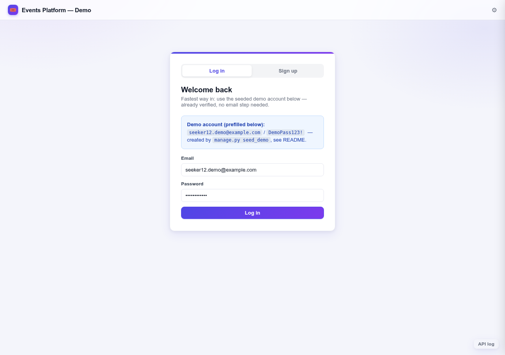
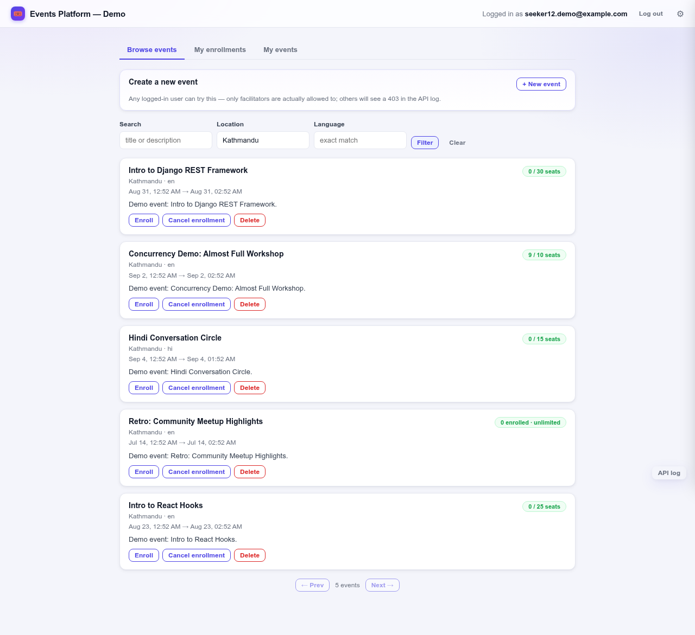
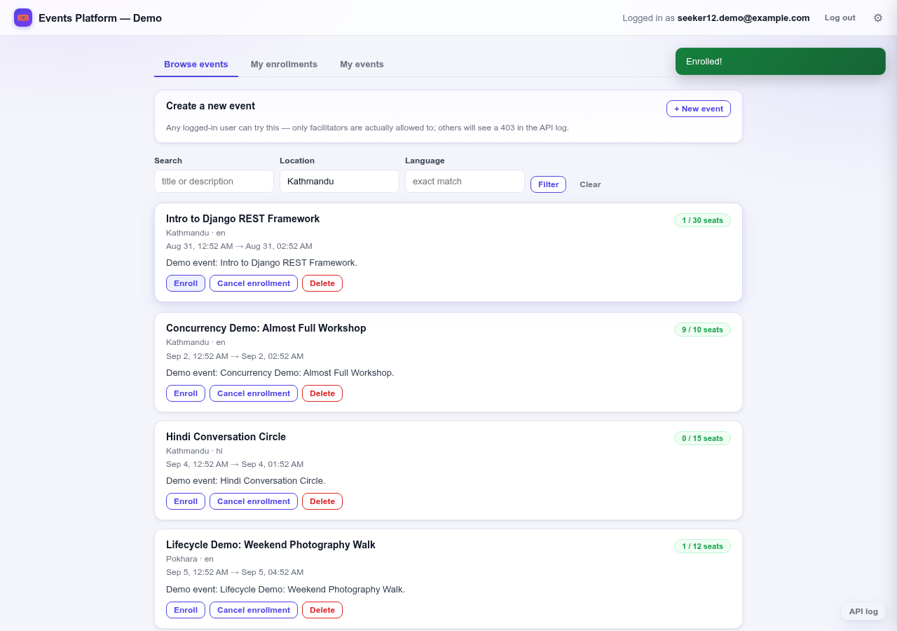
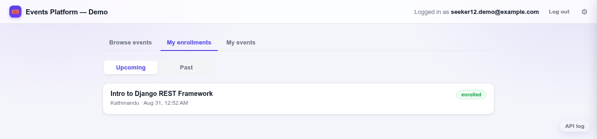

# Events Platform — Backend

A Django REST Framework backend for an events platform: facilitators create
events, seekers discover and enroll in them. Built in phases; see
`AGENT_SPEC.md`-derived plan below for what exists so far.

**Status: all phases complete (1 through 8)** — Phase 3b was done out of
the phase-plan's numeric order, at explicit direction; every other phase
followed the plan's order. Identity/OTP, events, discovery, the
enrollment lifecycle (both concurrency-safe and history-preserving — see
"Enrollment" below and `DEBUGGING.md`), rate limiting, the global error
format, demo seed data, and a Postman collection all exist and are
tested against real PostgreSQL (+ Redis for cache/throttling).

**Live demo:** deployed on a single AWS EC2 instance —
[http://32.237.58.194/static/demo/index.html](http://32.237.58.194/static/demo/index.html)
(the demo frontend; use either seeded demo account button, no signup
needed). API root is at `http://32.237.58.194/api/`. This is a personal
EC2 box kept up for grading, not a permanent service — see "Known
limitations / notes" for what it deliberately doesn't do (HTTPS, etc.).

## Architecture summary

**Apps.** Four Django apps under `apps/`, each with a clear boundary:

- `accounts` — `Profile` (role + verification state, one-to-one on the
  default `User`), `EmailOTP`, and everything auth: signup, verify,
  resend, login, refresh. `otp.py` (generation/hashing), `services.py`
  (the actual business logic — `verify_email`, `authenticate_and_issue_tokens`,
  `resend_otp`), `views.py` (thin HTTP wrappers around the services)
  are deliberately separate files, so the business logic is testable and
  readable independent of the HTTP layer.
- `events` — the `Event` model (with its three `CheckConstraint`s and
  three indexes), facilitator CRUD, role/ownership permissions, and
  discovery filtering (`filters.py`).
- `enrollments` — the `Enrollment` model (partial unique constraint —
  see "Enrollment" below), `services.py` (`enroll_seeker`/
  `cancel_enrollment` — the concurrency-safe versions, see
  `DEBUGGING.md` for the naive version this replaced), and the
  seeker-facing enrollment listing.
- `common` — shared, HTTP-layer-independent pieces: the coded API
  exceptions (`exceptions.py`) and the global exception handler
  (`exception_handlers.py`) that normalizes DRF's own built-in error
  shapes to match them, plus the `seed_demo` management command and the
  single-file demo frontend (`static/demo/index.html`).

**Request flow.** Every authenticated request carries a SimpleJWT bearer
token (`JWTAuthentication`, configured globally). DRF's
`ScopedRateThrottle` sits in front of signup/login/resend-otp, backed by
Redis so the limit is shared across processes, not per-worker. Every
error response — whether raised explicitly by application code
(`apps.common.exceptions`, which already render as `{"detail", "code"}`
by construction) or one of DRF's own built-ins (`ValidationError`,
`NotFound`, `Throttled`, ...) — passes through one global exception
handler that guarantees the same `{"detail", "code"}` shape everywhere,
so no endpoint has a bespoke error format.

**Where correctness actually lives**, the three mechanisms worth knowing
about before reading the code:

1. **`LOWER(email)` uniqueness** is a raw-SQL partial unique index
   (`RunSQL` migration), not a Django-level check — `User.email` isn't
   unique by default, and a naive unique index would break
   `createsuperuser`'s emailless accounts. `WHERE email <> ''` is the
   fix.
2. **Enrollment history** never gets deleted or mutated backward: a
   `UniqueConstraint` on `(event, seeker)` with `condition=Q(status=
   "enrolled")` allows unlimited canceled rows but at most one active
   one — so "enroll → cancel → enroll again" always creates a genuinely
   new row rather than reviving the canceled one (Challenge B).
3. **Capacity under concurrency** is `transaction.atomic()` +
   `Event.objects.select_for_update()`, checked against a maintained
   `seats_taken` counter rather than a live `COUNT` — the naive
   count-based version that Phase 6 briefly shipped, the real race it
   produced under genuine concurrent load, and the fix are documented in
   full in `DEBUGGING.md` (Challenge A).

**Deployment.** WhiteNoise lets the same Django process serve both the
API and the static demo frontend in production, not just under
`runserver` — see "Deployment" below and `DEPLOY.md` for the tested,
containerized single-EC2-instance path.

## Stack

- Django 4.2, Django REST Framework
- `django.contrib.auth.models.User` (default user model — not swapped, not
  subclassed)
- SimpleJWT for authentication
- PostgreSQL (runtime **and** tests)
- Django console email backend (development-only, see below)
- Redis (cache backend + DRF throttle state, see "Redis" below)
- `django-environ` for configuration

## Requirements

- Python 3.12
- A PostgreSQL server reachable from this machine
- A Redis server reachable from this machine
- Docker (see "Database" and "Redis" below for how this project runs both)

## Database

This project targets PostgreSQL for both runtime and the test suite —
partial unique indexes (the `LOWER(email)` constraint, the "one active
enrollment" constraint) and `select_for_update()` row locking either silently
no-op or behave differently on SQLite, so a green test suite on SQLite would
not prove the app is correct.

In this development environment there was no accessible superuser on the
machine's system PostgreSQL install (no known password, no passwordless
`sudo`), so the project runs its own PostgreSQL 16 in Docker instead of using
the system install:

```bash
docker compose up -d
```

This starts a `postgres:16` container on **host port 5433** (not 5432, to
avoid clashing with any system Postgres) with credentials taken from `.env`.
Data persists in a named Docker volume across restarts. This is just this
project's chosen way of *having* a Postgres server to point Django at —
anyone running this elsewhere can instead point `DATABASE_HOST`/`DATABASE_PORT`
in `.env` at any Postgres 16 server they already have.

The Django test runner creates/drops its own `test_<DATABASE_NAME>` database
on the same server automatically; no separate test configuration is needed.

## Redis

Redis is `CACHES["default"]` and backs DRF throttling on
signup/login/resend-otp — this is what makes throttle counters shared
across Django processes/workers instead of each process throttling
independently.

**Redis is scoped to cache and throttle state only.** It never stores OTPs
or any other durable data — OTP data (`EmailOTP` rows) lives entirely in
PostgreSQL. This matters for correctness, not just tidiness: Redis data can
be evicted or flushed at any time, and if OTP business logic (the 60-second
resend cooldown, the 5-per-hour cap) depended on Redis state, an eviction
would silently hand a user extra resends. Both are instead derived from
`EmailOTP` rows in Postgres, keyed by normalized email (see
`apps.accounts.services.resend_otp`).

Like Postgres, this project runs its own project-local Redis via Docker
(`docker compose up -d` starts both). It listens on host port **6379** and
has no auth — it's not exposed beyond the host and holds nothing durable, so
this stays intentionally minimal. Redis data lives in a named Docker volume,
though nothing currently stored in it needs to survive a restart.

**Tests never require a running Redis** — except one dedicated file. `manage.py
test` sets `DJANGO_TESTING=True` internally (see `manage.py`), which
switches `CACHES["default"]` to Django's in-process `LocMemCache`, so the
ordinary suite is green with Redis stopped. `apps/accounts/tests/test_throttling.py`
is the one exception: it explicitly reconnects to a real Redis, at a
separate database index from the app's own (`REDIS_THROTTLE_TEST_URL`,
default db 15 vs the app's db 0), flushes it in `setUp`, and skips itself
with a clear message if that Redis is unreachable — verified directly:
stopping the Redis container makes those 4 tests report `skipped` (not
`FAILED`) while the other 105 stay green.

**Failure mode if Redis is down at runtime:** `IGNORE_EXCEPTIONS` is
deliberately left at its default (`False`) in the `django-redis` config. If
Redis is unreachable, cache/throttle operations raise instead of silently
no-op'ing. In other words, a dead Redis surfaces as errors on throttled
endpoints rather than as unlimited, unthrottled requests — throttling fails
loudly, not open.

## Setup

```bash
# 1. Python virtualenv
python3 -m venv .venv
source .venv/bin/activate
pip install -r requirements.txt

# 2. Environment
cp .env.example .env
# edit .env: set a real DJANGO_SECRET_KEY and DATABASE_PASSWORD

# 3. Database + Redis
docker compose up -d

# 4. Migrate
python manage.py migrate

# 5. Run
python manage.py runserver
```

## API

### Error format

Every error response, from every endpoint, is shaped:

```json
{"detail": "Human-readable message", "code": "snake_case_code"}
```

Business-specific codes (`event_full`, `already_enrolled`,
`no_active_enrollment`, `otp_expired`, `otp_invalid`,
`otp_attempts_exceeded`, `otp_resend_cooldown`, `email_not_verified`) come
from dedicated exception classes in `apps/common/exceptions.py` — each one
already renders in exactly this shape by construction (see that module's
docstring for how, without needing any global handler). Everything else —
plain validation errors, `401`/`403`/`404`/`405`/`429` from DRF's own
built-in exceptions — is normalized into the same shape by the global
handler in `apps/common/exception_handlers.py`
(`REST_FRAMEWORK["EXCEPTION_HANDLER"]`), using generic codes:
`validation_error`, `not_authenticated`, `authentication_failed`,
`permission_denied`, `not_found`, `method_not_allowed`, `throttled`.
Validation errors from a serializer with multiple field errors are
flattened to a single representative message — the granularity of which
field failed isn't preserved in this shape, since the spec's error format
is a flat, single `{detail, code}` object.

### `POST /api/auth/signup/`

Public (no auth required). Body:

```json
{"email": "seeker@example.com", "password": "a-strong-password", "role": "seeker"}
```

`role` must be `"seeker"` or `"facilitator"`. A `username` field in the
request body, if present, is ignored — Django's `User` requires one, but
the client never supplies it; it's generated server-side (a UUID) and never
exposed back to the client.

On success (`201`), creates the `User` (email lowercased/normalized) and a
`Profile` with `is_email_verified=False`, and issues + emails a 6-digit OTP.
The OTP is never present in the response, in application logs, or anywhere
but its HMAC-SHA256 hash in the database. Response body:

```json
{"email": "seeker@example.com", "role": "seeker", "is_email_verified": false, "detail": "..."}
```

`400` on invalid role, weak password (Django's configured password
validators), or an email that already exists (case-insensitively) — backed
by both an application-level check and the database's partial unique index
on `LOWER(email)`, so this holds even under a signup race on the same
email.

### `POST /api/auth/verify-email/`

Public. Body: `{"email": "...", "otp": "123456"}`.

`200` with `{"detail": "Email verified."}` on the correct, unexpired code
for the latest active OTP, and marks the email verified. Coded errors
(`400` unless noted), all shaped `{"detail": "...", "code": "..."}`:

- `otp_invalid` — wrong code, **or** no active OTP for that email at all
  (including an email that was never signed up). These are deliberately
  indistinguishable so this endpoint can't be used to enumerate registered
  emails.
- `otp_expired` — the OTP's 10-minute TTL has passed.
- `otp_attempts_exceeded` — this attempt was the 5th wrong guess; the OTP
  is deactivated at that point (even the correct code stops working — a
  new one has to be issued, via resend below).

### `POST /api/auth/resend-otp/`

Public. Body: `{"email": "..."}`.

`200` with `{"detail": "A new verification code has been sent."}` on
success: issues a fresh OTP, emails it, and **invalidates every previously
issued OTP for that user** — only the newest is ever valid; an older code
now behaves exactly like an invalid one (`otp_invalid`).

`400` on an email with no matching account. This endpoint intentionally
does **not** hide whether an email is registered, unlike login/verify-email
above: it's an account-management operation like signup (which already
has to reveal duplicate emails to reject them), not a secret-guessing
endpoint — see `DECISIONS.md`.

`429` `otp_resend_cooldown` for either of two OTP-business-logic conditions
that share the single code the spec defines for this — the response
`detail` text differs, but `code` doesn't:
- less than 60 seconds since the last OTP (of any status) was issued to
  this user;
- 5 or more OTPs already issued to this user in the trailing hour (a
  rolling window, not calendar-hour-aligned) — counting every OTP issued
  in that window, including the one from signup itself, since `EmailOTP`
  has no field distinguishing "issued by signup" from "issued by resend".

This cooldown/cap is OTP business logic (`apps.accounts.services.resend_otp`),
enforced independently of — and in addition to — the DRF rate limit on
this same endpoint described below.

### `POST /api/auth/login/`

Public. Body: `{"email": "...", "password": "..."}`.

`200` with `{"access": "...", "refresh": "..."}` (SimpleJWT tokens) once
the email is verified. `401` `authentication_failed` (DRF's stock
`AuthenticationFailed`, normalized by the global exception handler — see
"Error format" below) for both wrong password and unknown email, with an
identical body either way, so login can't be used to enumerate registered
emails. `403`
`email_not_verified` for a correct password on an unverified account —
checked only *after* the password itself has already checked out, so it's
never revealed for a wrong password on an unverified account either.

### `POST /api/auth/refresh/`

Public. Body: `{"refresh": "..."}`. SimpleJWT's own stock
`TokenRefreshView` — no custom behaviour needed here.

### Rate limiting

`signup`, `login`, and `resend-otp` are DRF-throttled (`ScopedRateThrottle`),
env-configurable, defaulting to `AUTH_LOGIN_RATE=10/min`,
`AUTH_SIGNUP_RATE=5/hour`, `AUTH_RESEND_OTP_RATE=5/hour`. Throttle state
lives in the Redis-backed cache (see "Redis" above), so it's shared across
processes/workers, not per-process. A throttled request gets `429`
`throttled` (DRF's stock `Throttled`, normalized the same way as login's
`401` above).

This is a genuinely separate layer from resend's own 60s cooldown/5-per-hour
cap described above: DRF throttling is API abuse protection (how many
requests, period); the OTP cooldown/cap is business logic about how many
*codes* get issued. They're not substitutes for each other and both apply
independently — e.g. hitting `/resend-otp/` 6 times in an hour could trip
either the OTP-logic cap (`429 otp_resend_cooldown`) or, separately, the
DRF scope limit (plain `429`), depending on timing.

**Test isolation**: the ordinary test suite disables throttling entirely
(every `auth_*` rate is `None` when running under `manage.py test` — see
`config/settings.py`), so no unrelated test can fail from tripping a rate
limit. `apps/accounts/tests/test_throttling.py` is the one place that
re-enables the real rates and tests them directly, clearing the throttle
cache in `setUp`. Re-enabling them isn't simply `@override_settings` —
see that file's module docstring for a real DRF gotcha this ran into
(`SimpleRateThrottle.THROTTLE_RATES` is a class attribute snapshotted once
at import time, not dynamically re-read from `api_settings`) and how it's
actually done (`mock.patch.dict` on the live dict object).

### Events

All require authentication (a valid access token).

| Method | Path | Access |
|---|---|---|
| GET | `/api/events/` | any authenticated user |
| GET | `/api/events/{id}/` | any authenticated user |
| POST | `/api/events/` | facilitator |
| PATCH | `/api/events/{id}/` | the facilitator who owns the event |
| DELETE | `/api/events/{id}/` | the facilitator who owns the event |
| GET | `/api/facilitator/events/` | facilitator, own events only |

`POST`/`PATCH` body: `title`, `description`, `language`, `location`,
`starts_at`, `ends_at` (both ISO 8601 UTC), `capacity` (integer or `null`
for unlimited). `seats_taken` and `created_by` are always server-controlled
— present in responses, ignored if sent in a request body. `PUT` is not
supported (`405`) — only `PATCH` for partial updates, per spec.

`400` if `ends_at` is not after `starts_at`, or `capacity` is negative —
enforced both by the serializer (clean `400`) and by database
`CheckConstraint`s (`event_ends_after_starts`, `event_seats_taken_non_negative`,
`event_seats_taken_le_capacity`) as a backstop. `403` for a role/ownership
violation (wrong role on create, non-owner on update/delete).

`GET /api/facilitator/events/` returns the requesting facilitator's own
events only, each with `enrolled_count` (= `seats_taken`) and
`available_seats` (`capacity - seats_taken`, or `null` when `capacity` is
`null`) — both derived from the `seats_taken` counter on `Event`, which
enroll/cancel now keep accurate under real concurrency (see "Enrollment"
below).

#### Discovery: `GET /api/events/` query parameters

| Param | Behaviour |
|---|---|
| `q` | `icontains` on `title` **or** `description` |
| `location` | exact match (not `icontains` — see note below) |
| `language` | exact match |
| `starts_after` | `starts_at` strictly after this ISO 8601 datetime |
| `starts_before` | `starts_at` strictly before this ISO 8601 datetime |

All supplied filters combine with AND. `starts_after`/`starts_before` use
strict `>`/`<` (an event starting exactly at the boundary is excluded) —
the literal reading of "after"/"before"; say the word if you want them
inclusive instead. A malformed `starts_after`/`starts_before` returns a
clean `400`, not a server error.

`location`/`language` are exact-match, not `icontains`, deliberately: they
have their own composite indexes (`(location, starts_at)`,
`(language, starts_at)`) which an exact match can actually use — unlike
`q`, which is genuine free-text search and can't use a plain B-tree index
either way (see "Known limitations" below).

Results are ordered `(starts_at < now()) ASC, starts_at ASC` — upcoming
events first (soonest first), then past events (oldest first) — exactly
matching the spec's ordering, verified directly against the generated SQL
(`ORDER BY 13 ASC, starts_at ASC` where column 13 is the `CASE WHEN
starts_at < now() THEN 1 ELSE 0 END` expression). Pagination is
`{count, next, previous, results}`, page size 20, same global DRF config
since Phase 1.

### Enrollment

| Method | Path | Access |
|---|---|---|
| POST | `/api/events/{id}/enroll/` | seeker only |
| POST | `/api/events/{id}/cancel/` | seeker only |
| GET | `/api/enrollments/?scope=upcoming\|past` | seeker only, own rows |

**Enroll** — `201` with the new `Enrollment` row (nesting a short event
summary) on success. `409` `already_enrolled` if the seeker already has
an active enrollment for this event. `409`
`{"detail": "Event is full", "code": "event_full"}` (exact spec wording)
if `capacity` is set and already met.

**Capacity checking is concurrency-safe.** Enroll opens
`transaction.atomic()` and immediately takes
`Event.objects.select_for_update()` on the event row, so every concurrent
enroll/cancel attempt for the same event is serialized: capacity is
checked against `Event.seats_taken` (not a live row count), the
`Enrollment` row is created, and `seats_taken` is incremented — all inside
that same locked transaction. Verified under genuine concurrency, not just
assumed: `apps/enrollments/tests/test_concurrency.py` (Challenge A) runs 5
seekers concurrently for 1 remaining seat via `TransactionTestCase` +
`ThreadPoolExecutor`, and a manual test against a live server with 5 real
concurrent `curl` processes showed the identical result — exactly 1
`201`, four `409 event_full`, `seats_taken` landing at exactly the
capacity. Phase 6's naive first version (counted active rows, no lock) is
the subject of a full red→green writeup in `DEBUGGING.md`, including the
actual race numbers it produced.

Real output from re-running that test against a fresh Postgres, captured
on 2026-08-28 (no screenshot — this is the actual terminal output, which
proves the same thing a screenshot would and stays copy-pasteable):

```
$ python manage.py test apps.enrollments.tests.test_concurrency -v 2
Creating test database for alias 'default' ('test_events_db')...
...
System check identified no issues (0 silenced).
test_exactly_one_of_five_concurrent_enrolls_succeeds_on_the_last_seat
(apps.enrollments.tests.test_concurrency.ConcurrentEnrollmentTests...) ... ok

----------------------------------------------------------------------
Ran 1 test in 2.918s

OK
Destroying test database for alias 'default' ('test_events_db')...
```

Deployed instances with pre-existing `Enrollment` data get `seats_taken`
backfilled from the real active-enrollment count by a data migration
(`enrollments/migrations/0002_backfill_seats_taken.py`) before this
locking takes effect, so the counter never starts out lying.

**Cancel** — `200`, mutates the existing active row in place
(`status="canceled"`, `canceled_at` set) — it does **not** create a new
row and does **not** delete anything. `404` `no_active_enrollment` if the
seeker has no active enrollment for this event. Uses the identical
locking pattern as enroll (same event row lock, same transaction),
decrementing `seats_taken` via `F("seats_taken") - 1`.

**Re-enrolling** (enroll → cancel → enroll again) always **creates a new
row** rather than reviving the canceled one — verified by a dedicated
test (Challenge B) that checks exactly two rows exist, with different
primary keys, the older `canceled` with `canceled_at` set, and the newer
`enrolled` with `canceled_at` null. History is never deleted and a
canceled row is never flipped back to `enrolled`.

**Listing** — `GET /api/enrollments/?scope=upcoming|past` (required,
exactly one of the two) returns *every* `Enrollment` row belonging to the
requesting seeker — both active and canceled/historical — split by
whether the related event's `starts_at` is in the future or the past.
This is a deliberate reading: since Challenge B's whole point is that
canceled rows are real, permanent history, this endpoint surfaces that
history rather than silently filtering it down to active rows only. Flag
if "own rows" was meant to mean "own *active* rows" instead.

## Environment variables

See `.env.example` for the full list. Notable ones:

| Variable | Meaning | Default |
|---|---|---|
| `DJANGO_SECRET_KEY` | Django secret key | none — must be set |
| `DJANGO_DEBUG` | Debug mode | `False` |
| `DJANGO_ALLOWED_HOSTS` | Comma-separated allowed hosts | `localhost,127.0.0.1` |
| `DATABASE_NAME` / `DATABASE_USER` / `DATABASE_PASSWORD` / `DATABASE_HOST` / `DATABASE_PORT` | Postgres connection | see `.env.example` |
| `JWT_ACCESS_TOKEN_LIFETIME_MINUTES` | SimpleJWT access token lifetime | `15` |
| `JWT_REFRESH_TOKEN_LIFETIME_DAYS` | SimpleJWT refresh token lifetime | `7` |
| `REDIS_URL` | Redis connection URL for the cache backend | `redis://localhost:6379/0` |
| `REDIS_PORT` | Host port the Docker Redis binds to | `6379` |
| `REDIS_THROTTLE_TEST_URL` | Separate Redis DB index used only by `test_throttling.py` | `redis://localhost:6379/15` |
| `AUTH_LOGIN_RATE` | DRF throttle rate, `POST /api/auth/login/` | `10/min` |
| `AUTH_SIGNUP_RATE` | DRF throttle rate, `POST /api/auth/signup/` | `5/hour` |
| `AUTH_RESEND_OTP_RATE` | DRF throttle rate, `POST /api/auth/resend-otp/` | `5/hour` |

`.env` is gitignored; only `.env.example` (with placeholder values) is
committed. No real secrets are committed anywhere in this repo.

## Demo data

```bash
python manage.py seed_demo
```

Creates 2 facilitators, 12 seekers (all pre-verified — no OTP step
needed to log in with them), and 10 events spanning past and upcoming
with mixed languages (`en`, `ne`, `hi`, `es`) and locations. Safe to
re-run: it deletes its own previously-seeded accounts (matched by their
fixed emails) and everything cascading from them, then recreates
everything fresh.

**Demo credentials** — every seeded account uses the same password,
`DemoPass123!`. This is a fixed, published, development-only password for
locally seeded data; it is not a real secret and nothing meaningful is
protected by it.

| Emails | Role |
|---|---|
| `facilitator1.demo@example.com`, `facilitator2.demo@example.com` | facilitator |
| `seeker1.demo@example.com` … `seeker12.demo@example.com` | seeker |

Two events are seeded specifically to demonstrate the two challenges:

- **Concurrency demo** (Challenge A): the event titled *"Concurrency
  Demo: Almost Full Workshop"* has `capacity=10` and exactly 9 active
  enrollments already — one seat left. `POST /api/events/{id}/enroll/`
  as several different seekers at once (e.g. `seeker10`–`seeker12`, which
  aren't already enrolled in it) to see the capacity check hold under
  real concurrency.
- **Lifecycle demo** (Challenge B): `seeker10.demo@example.com` already
  has a completed enroll → cancel → enroll history on the event titled
  *"Lifecycle Demo: Weekend Photography Walk"* — `GET /api/enrollments/`
  for that seeker shows the current (re-)enrolled row; the database has
  two rows for that (event, seeker) pair, the older one canceled.

The command prints the exact event IDs and seat counts it created each
time it runs, so you don't have to look them up separately.

## Postman collection

[`postman/events-platform.postman_collection.json`](postman/events-platform.postman_collection.json)
covers every endpoint above, organized into Auth / Events / Enrollment
folders. Import it, set the `base_url` collection variable if your server
isn't on `http://localhost:8000`, then run **Login** — its Tests script
saves the returned tokens into `{{access_token}}`/`{{refresh_token}}`
collection variables automatically, so every other request just works
without manual copy/paste. It defaults to logging in as a seeded demo
facilitator (`seed_demo` above), but you can point `demo_email`/
`demo_password` at any account, or use Signup/Verify Email to create a
fresh one first.

## Demo frontend

A single, dependency-free HTML file (`apps/common/static/demo/index.html`)
exercises the whole API from a browser — guided signup/verify/login,
event search/create/delete, enroll/cancel, and "my enrollments"/"my
events". With `docker compose up -d` and `python manage.py runserver`
running, open:

```
http://localhost:8000/static/demo/index.html
```

It's served by Django's own `staticfiles` app (automatic in `DEBUG` mode
— see "Known limitations" below), so it's same-origin with the API and
needs no CORS configuration. No build step, no framework, no CDN —
vanilla HTML/CSS/JS, viewable by opening the file itself.

### Primary path: log in with a seeded account

**Login is the default tab, and the form is prefilled with a seeded demo
seeker's credentials** — `seeker12.demo@example.com` / `DemoPass123!`,
also shown in plain text right above the form. Run `python manage.py
seed_demo` first (see "Demo data" above), then just click **Log in**: no signup, no
verification, straight through to events. That account is deliberately
one of the two seeded seekers with no pre-existing enrollments, so
Enroll always succeeds cleanly on a first walkthrough.



From there: filter events (search/location/language)...



...enroll, and see it reflected immediately (seat count, toast, and the
API log all agree)...



...then check it under "My enrollments":



### Secondary path: signup and verification

Sign up and verify-email screens still exist (the **Sign up** tab), for
exercising that flow specifically rather than as the primary way into the
app. Signup auto-advances into a "check your email" screen — email
pre-filled, the code input auto-focused — instead of leaving you to
re-open a second form. Logging in with an unverified account drops into
the *same* screen rather than just showing an error, since that actually
is the next step. A **Resend** link is there too, with a 60-second
client-side cooldown timer matching the server's own policy (a UX nicety
only — the server enforces the real cooldown/cap regardless). The moment
verification succeeds, the page automatically logs you in with the same
credentials and drops you straight into the app.

**The OTP itself is never shown in the UI, on purpose.** No API response
ever contains the plaintext code (see "Security" throughout this
project), so there is nothing for the frontend to display. The verify
screen's callout instead says exactly where to find it: *"The 6-digit
code is printed to the Django console (development email backend, per
the assignment brief)"* — check the terminal running `manage.py
runserver` for a line like `Your verification code is: 123456`. That's a
hard constraint, not a missing feature — no demo convenience is worth
weakening that rule, and none was added to work around it.

Beyond auth, a live request/response log (bottom-right, "API log") shows
every call's method, URL, status, and JSON body — including rejections,
which is useful for seeing the API's permission/validation errors
directly: the UI deliberately doesn't hide any action by role (e.g. a
seeker can still click "Create event"), it lets the API's own permission
checks reject it and shows that rejection in the log and as a toast,
rather than duplicating authorization logic on the client.

## Deployment

This deploys as **one service** — Django serves the API and the demo
frontend together, in production too, not just under `runserver`. That's
what [WhiteNoise](https://whitenoise.readthedocs.io/) is for: Django's own
static-file auto-serving only works in `DEBUG=True`/`runserver`; WhiteNoise
(`MIDDLEWARE`, right after `SecurityMiddleware`) lets the *same* process
keep serving `/static/...` — including `/static/demo/index.html` — once
`DEBUG=False`. No separate static host, no CDN, no CORS needed for the
demo page. This works the same way on AWS EC2, Elastic Beanstalk, ECS/
Fargate, App Runner, or any other platform that runs a single container/
process — you're deploying one thing, not a frontend and a backend
separately.

**[DEPLOY.md](DEPLOY.md) is the concrete, tested walkthrough** — a
`Dockerfile` + `docker-compose.prod.yml` running the app, Postgres, and
Redis together as three containers on a single AWS EC2 instance (chosen
over App Runner/ECS specifically because those only run the web
container — Postgres/Redis would need RDS + ElastiCache in a VPC, three
managed services instead of one box running the compose file this
project already has). Every step in it — build, migrate, collectstatic,
`seed_demo`, the actual HTTP requests — was run for real against an
isolated container stack before being written down, not just described.
This isn't just a walkthrough that was followed once and abandoned —
it's what's actually running at
[http://32.237.58.194/static/demo/index.html](http://32.237.58.194/static/demo/index.html)
right now, on a real EC2 instance in `ap-southeast-2`, seeded with the
same `seed_demo` data described above.

The platform-agnostic shape, if you're deploying somewhere other than
that Docker/EC2 path:

```bash
pip install -r requirements.txt

# Real values for all of these — DJANGO_DEBUG unset/false, a generated
# DJANGO_SECRET_KEY, DJANGO_ALLOWED_HOSTS set to your real domain(s),
# DATABASE_*/REDIS_URL pointing at managed Postgres/Redis (e.g. RDS/
# ElastiCache) rather than the local docker-compose services, which are
# dev-only. See "Environment variables" above for the full list.

python manage.py migrate
python manage.py collectstatic --noinput   # populates STATIC_ROOT for WhiteNoise
gunicorn config.wsgi:application --bind 0.0.0.0:$PORT   # never runserver in production
```

**Not configured here, on purpose — depends on your TLS setup**:
`python manage.py check --deploy` flags `SECURE_HSTS_SECONDS`,
`SECURE_SSL_REDIRECT`, `SESSION_COOKIE_SECURE`, and `CSRF_COOKIE_SECURE`.
All four are about HTTPS enforcement, and the right values depend on where
SSL is actually terminated (this app directly, vs. a load balancer/reverse
proxy in front of it, which would also need `SECURE_PROXY_SSL_HEADER` set
to match). Hardcoding them without knowing that would either do nothing
or break local/non-HTTPS testing, so this is flagged as a real gap to
close before serving real traffic, not silently decided here.

## Running tests

```bash
python manage.py test
```

Requires the Postgres server from `docker compose up -d` to be running and
reachable via the `.env` settings. Does **not** require Redis — see "Redis"
above.

## Project layout

```
config/             Django project (settings, urls, wsgi/asgi)
apps/common/          shared pieces: the coded API exceptions, the global
                     exception handler, the `seed_demo` management command
apps/accounts/       users, profiles, email OTP, signup/verify/login/refresh
apps/events/         Event model, CRUD, discovery, enroll/cancel views
apps/enrollments/     Enrollment model, permissions, concurrency-safe
                     enroll/cancel logic, enrollment listing
```

`apps/` is a plain namespace directory (not a Django app itself) so app
labels stay short (`accounts`, `events`, `enrollments`) while imports are
namespaced (`apps.accounts`, ...).

## Known limitations / notes

- **Console email backend.** `EMAIL_BACKEND` is Django's console backend,
  which writes outgoing email (including, in later phases, OTP codes) to
  stdout instead of sending it. This is explicitly permitted by the
  assignment and is **development-only** — a real deployment needs a real
  email backend/provider.
- **`q` search uses `icontains`.** `icontains` on `title`/`description`
  cannot use a plain B-tree index (there's no leading prefix to seek on)
  and will degrade on a large `Event` table — unlike `location`/`language`,
  which are exact-match specifically so they *can* use their composite
  indexes. A `pg_trgm` GIN index or Postgres full-text search would be the
  production answer; deliberately not added here to keep the assignment
  compact.
- **The demo frontend is a developer-facing tool, not a real product
  frontend** — it ships in this repo and deploys with the app (see
  "Deployment" above; WhiteNoise serves it in production too, not just
  under `DEBUG=True`), but a real deployment of this project wouldn't
  want a demo/testing page reachable at `/static/demo/index.html`
  alongside a real frontend. Removing it (or gating it behind `DEBUG`)
  would be a one-line call before shipping this beyond a grading/demo
  context.
- Further limitations will be added here as later phases introduce the
  behaviour they apply to.

## What I'd improve with another day

In rough priority order:

1. **Facilitator attendee visibility.** Right now a facilitator sees
   `enrolled_count` for their own event but not *who* enrolled — that's
   deliberate, matching the spec's "view own event enrollment counts"
   exactly (not identities), but it's the first thing a real facilitator
   would ask for. A well-scoped addition: a
   `GET /api/events/{id}/enrollments/` endpoint, owner-only, returning
   seeker emails and enrollment status for that one event.
2. **`q` search on a real index.** Documented above as a known
   limitation — `pg_trgm` (GIN index) or Postgres full-text search
   (`SearchVector`/`SearchQuery`) would make `q` scale past a small demo
   dataset. Deliberately left out to keep the schema compact, per the
   brief.
3. **HTTPS in front of the AWS deployment.** `DEPLOY.md`'s EC2 setup
   serves plain HTTP. The next step is either an Application Load
   Balancer with an ACM certificate, or Caddy as a reverse proxy on the
   instance itself — and only then turning on the HSTS/secure-cookie
   settings that `manage.py check --deploy` already flags as currently
   (correctly) unset.
4. **CI.** There's no GitHub Actions workflow running the test suite on
   push yet — everything's been verified by running the suite locally
   against real Postgres/Redis before every commit, but that's a manual
   discipline, not an enforced one. A workflow spinning up Postgres +
   Redis service containers and running `manage.py test` on every PR
   would close that gap, and is a natural precursor to real CI/CD
   auto-deploy (discussed and deliberately deferred during the AWS
   setup — see `PROMPT_LOG.md`).
5. **Move Postgres/Redis off the app instance.** The current AWS
   deployment runs all three containers on one EC2 box (see
   `DECISIONS.md` for why, given the project's scale) — RDS +
   ElastiCache would be the real next step if this needed to survive an
   instance failure or scale past one box.
6. **Automated coverage for the demo frontend.** It's been verified
   manually and via one-off Playwright scripts during development (see
   `PROMPT_LOG.md`), but there's no repeatable, checked-in browser test
   for it — low priority, since it's explicitly a developer-facing demo
   tool, not the graded API surface, but worth having if it grows.
